# Adminitration System Practical Reports 1
___
Practical question.


From the question, we make changes on "soal latihan praktikum" according to "soal praktikum". Link for Practical Question [Disini.](https://github.com/aldonesia/Sistem-Administrasi-Server-2021/blob/master/modul-1/soal_praktikum.md)

### 1. Change container name from ubuntu php_5.6 to ubuntu_landing and config IP with new condition
___

- rename ubuntu_php5.6 to ubuntu_landing

    - stop ubuntu from previous condition

        ```bash
        sudo lxc-stop -n ubuntu_php5.6
        ```
    - change container name then start container

        ```bash
        sudo lxc-copy -R -n ubuntu_php5.6 -N ubuntu_landing
        sudo lxc-start -n ubuntu_landing
        ```
    - check list container
        ```bash
        sudo lxc-ls -f
        ```
        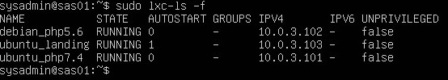
- setting ip 10.0.3.103

     - attach container and open network interfaces

        ```bash
        sudo lxc-attach -n ubuntu_landing
        nano /etc/network/interfaces
        ```
        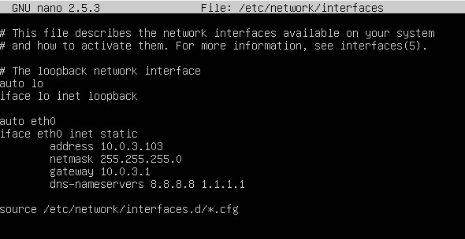
    - restart network

        ```bash
        systemctl restart networking.service
        ifconfig
        ```
        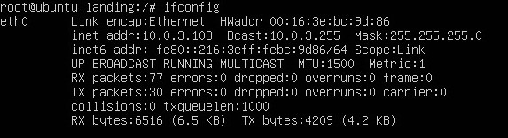
    - exit from ubuntu_lanidng and do the next step

        ```bash
        exit
        ```

### 2. Create Debian 9 LXC Container and the name is debian_php5.6 then config IP with new condition
___

- create container

     - create container debian 9 and start container

        ```bash
        sudo lxc-create -n debian_php5.6 -t download -- --dist debian --release stretch --arch amd64 --force-cache --no-validate --server images.linuxcontainers.org
        sudo lxc-start -n debian_php5.6
        ```
    - check container list
        ```bash
        sudo lxc-ls -f
        ```
        
- install nginx and nginx-extras 

    - install nginx and nginx-extras inside the container
        ```bash
        sudo apt install nginx nginx-extras
        ```

- setting ip 10.0.3.102

    - attach to container and install net-tools curl then open network interfaces

        ```bash
        sudo lxc-attach -n debian_php5.6
        apt install nano net-tools curl
        nano /etc/network/interfaces
        ```
        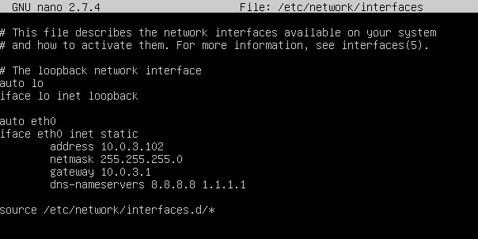
    - restart network and check ip

        ```bash
        systemctl restart networking.service
        ifconfig
        ```
        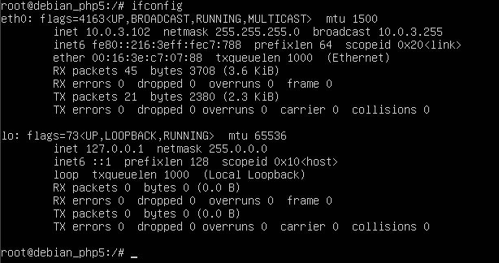

### 3. setting nginx debian_php5.6 with domain http://lxc_php5.dev and create LXC description inside
___

- setting nginx

    - open sites available directory and create empty file with name lxc_php5.6.dev

        ```bash
        cd /etc/nginx/sites-available
        touch lxc_php5.6.dev
        nano lxc_php5.6.dev 
        ```
        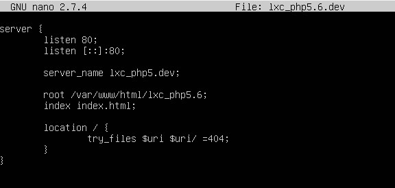
    - open sites enabled directory, create symbolic link file container and do testing then open directory host file

        ```bash
        cd ../sites-enabled
   	    ln -s /etc/nginx/sites-available/lxc_php5.6.dev .
   	    nginx -t
   	    nginx -s reload
   	    nano /etc/hosts
        ```
        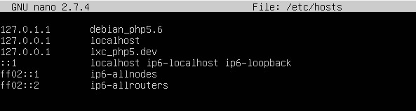
    - open html directory, create lxc_php5.6 directory dan copy code from nginx-debian.html to index.html then open index html file

        ```bash
        cd /var/www/html
        mkdir lxc_php5.6
        cp index.nginx-debian.html lxc_php5.6/index.html
        nano index.html
        ```
        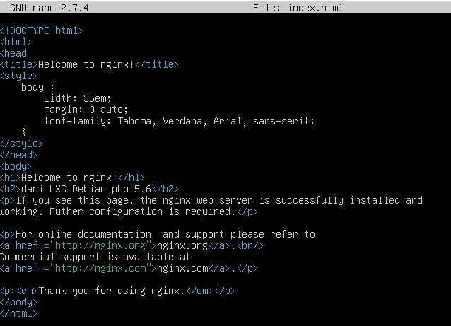
    - check connectivity to URL

        ```bash
        curl -i http://lxc_php5.dev
        ```
    - exit from debian_php5.6 and do the next step

        ```bash
        exit
        ```

### 4. setting nginx ubuntu_landing with domain http://lxc_landing.dev and create LXC description inside

- setting nginx

    - attach to container then open sites available directory

        ```bash
        sudo lxc-attach -n ubuntu_landing
        cd /etc/nginx/sites-available
        ```
    - rename file name and change the server_name and the directory

        ```bash
        mv lxc_php5.6.dev lxc_landing.dev
        nano lxc_landing.dev
        ```
        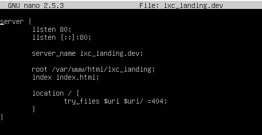
    - open sites enable directory, create symbolic link file container and do testing then open directory host file

        ```bash
        cd ../sites-enabled
   	    ln -s /etc/nginx/sites-available/lxc_landing.dev .
   	    nginx -t
   	    nginx -s reload
   	    nano /etc/hosts
        ```
        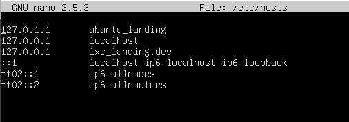
    - open var html directory and rename file lxc_php5.6 to lxc_landing then open index html

        ```bash
        cd /var/www/html
        mv lxc_php5.6 lxc_landing
        nano index.html
        ```
        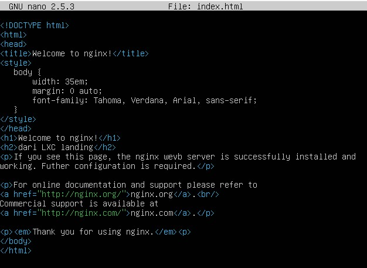
    - check connectivity to URL

        ```bash
        curl -i http://lxc_php5.dev
        ```
    - exit from ubuntu_landing and do next step

        ```bash
        exit
        ```
### 5. setting ubuntu landing to autostart when open the vm
- setting config container

    - setting config auto start with lxc.start.auto = 1

        ```bash
        echo "lxc.start.auto = 1" >> /var/lib/lxc/ubuntu_landing/config
        ```
    - check container list
        ```bash
        sudo lxc-ls -f
        ```
        
    - stop the container
        ```bash
        sudo lxc-stop -n ubuntu_landing
        ```
### 6. setting nginx on vm according to the question
- setting nginx 

    - setting nginx hosts

        ```bash
        sudo nano /etc/hosts
        ```
        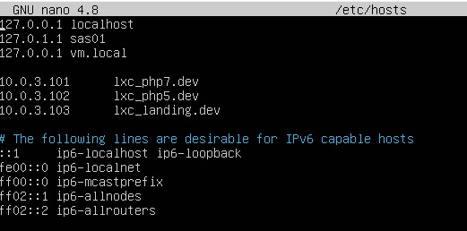
     - open sites available directory and open vm.local

        ```bash
        cd /etc/nginx/sites-available
        sudo nano vm.local
        ```
        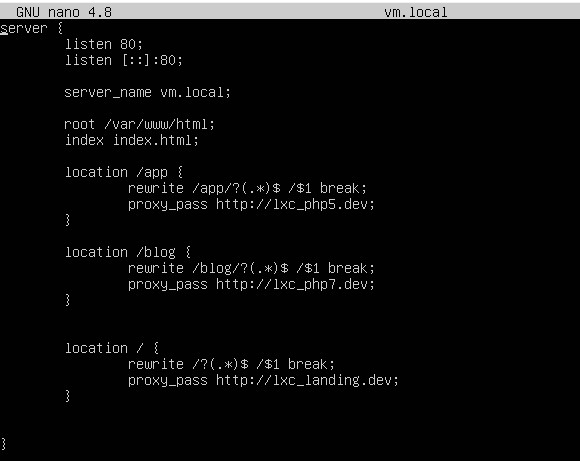
    - do testing then check connectivity to URL

        ```bash
        sudo nginx -t
        sudo nginx -s reload
        curl -i http://vm.local
        ```
### 7. testing on web browser
- testing web result 
    - access http://vm.local

        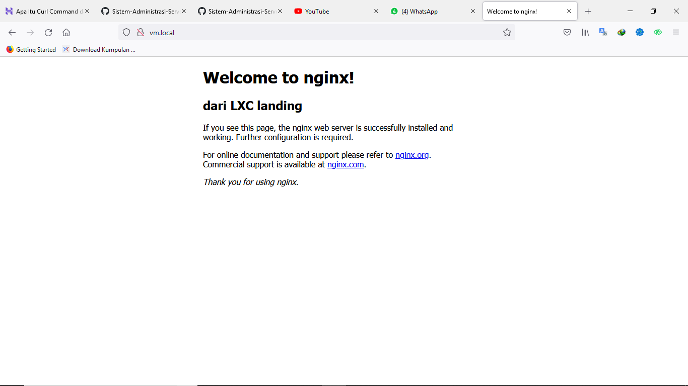
    - access http://vm.local/blog

        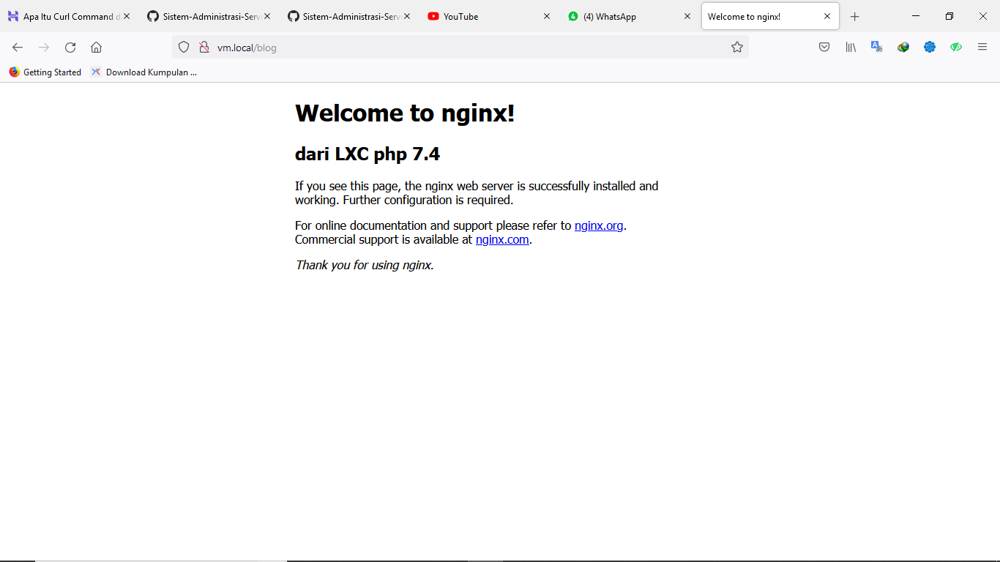
    - access http://vm.local/app

        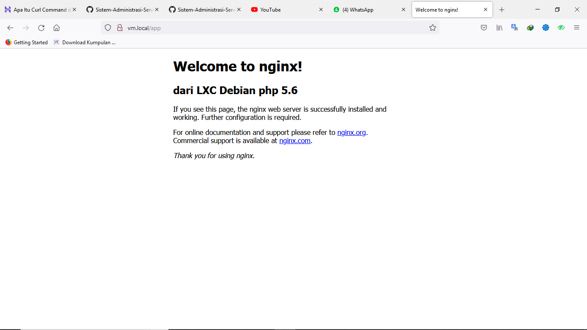
### 8. Analysis result
- Answer
    
    - In April 2021, Ubuntu 16.04 xenial will reach end of standart support and cant be used for php 5.6

    - Because the website schema used few different linux system. Therefore, using LXC virtualization make it easy to create servers 

    - a proxy server is a server application that acts as an intermediary between a client requesting a resource and the server providing that resource.
    From the case, vm.local as proxy server and web landing page. It's mean vm.localis a bridge to connect internet


Thank You, Report by
- Galih Dimas Prastowo  (1202190018)
- Muhammad Rafi Irzam   (1202190063)